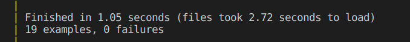
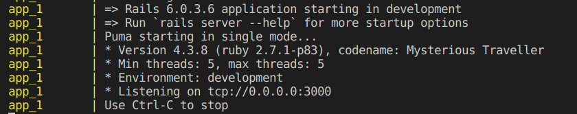
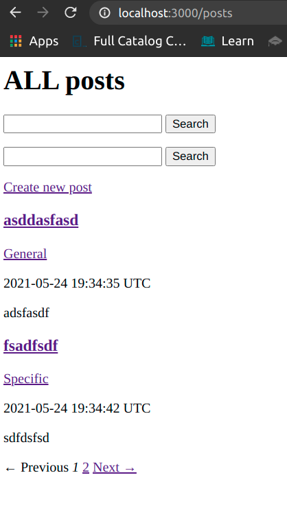
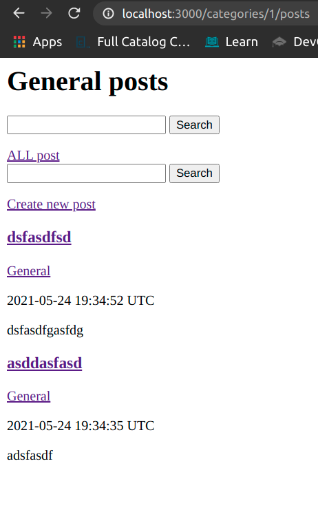
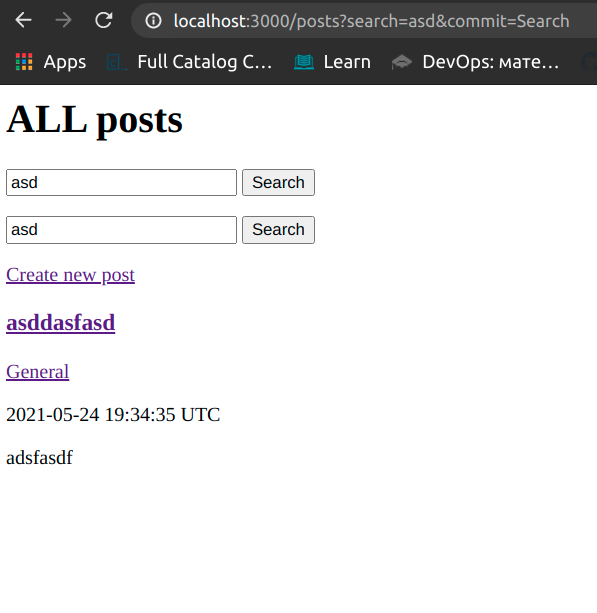
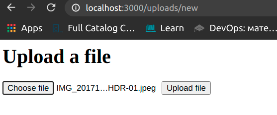
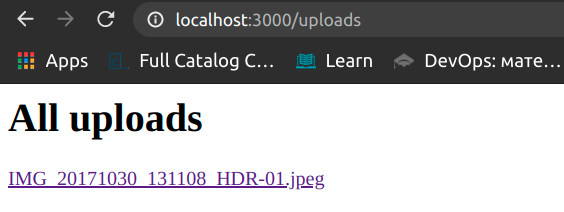
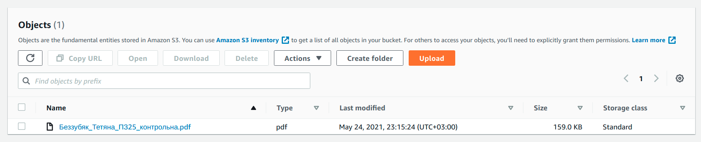
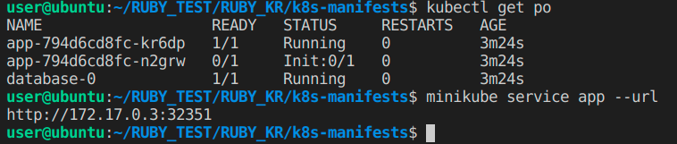
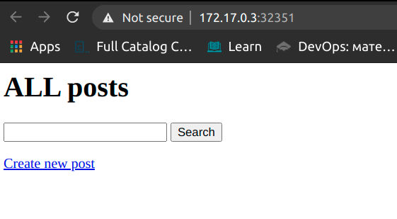

# What I have done
## unit tests

## docker-compose

## pagination

## filter by category

## search by title

## upload files to AWS S3 (ruby sdk)

## Kubernetes deployment in minikube (one of app pods is not initialized on screenshot, but it got ready in a few minutes (bad side of local deployment, everything is slow))

